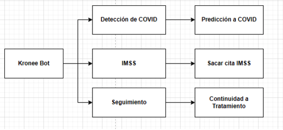
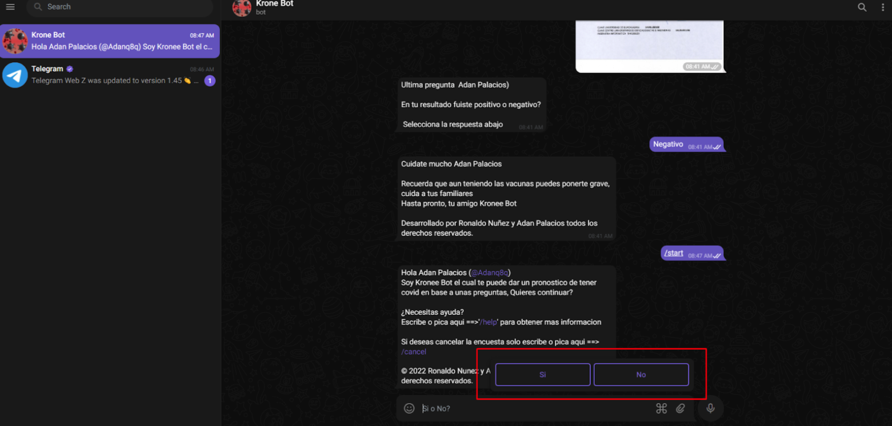

# Krone Bot

Desarrollar una herramienta de ayuda inteligente (Krone Bot) que ofrezca al paciente una guía de pasos 
y recomendaciones para la detección del COVID-19, permitiendo agilizar los procesos de atención médica.

## Planteamiento del Problema

Pandemia 2019 COVID-19 uno de los primeros problemas que nos ha dejado el nuevo virus  es el el sobre 
aglomeramiento de personas en los hospitales, puesto que esta nuevo virus tiende a dar síntomas como un 
resfriado común y/o tos común sin o con flemas, asi logrando asustar a la gente para realizarse una consulta médica.

## Restricciones

* Se requiere acceso a internet para su funcionamiento.
* Almacenamiento de pacientes mayores de edad únicamente.
* Se requiere una cuenta de telegram.
* La predicción no es 100% certera.

## Justificacion

Uno de los principales detalles que destacan el sistema es la posibilidad de hacer consulta desde cualquier 
dispositivo móvil con Android 6.0 o superior, iOS 9.0 o superior, así logrando evitar que los usuarios salgan 
de sus hogares y disminuir el contagio, evitando aglomeraciones en las consultas médicas y solo se realicen en
casos delicados o de extrema urgencia, al igual destaca su fácil funcionalidad, puesto que se debe responder ciertas
preguntas con (sí, no), después de tener las respuestas a ciertas preguntas se estará haciendo un perfil para su
evaluación temprana y en caso de tener algo más prejudicial se le hará la recomendación de ir a una consulta.

### Antecedentes del Estado del Arte

En el mercado se encuentra una aplicación el que ayude a la detección del covid-19 [3], pero se
requiere celulares en específico para que funcione sin ningún problema gracias a Krone Bot no requiere
de un celular moderno, solo se requiere apk Telegram instalada.

#### Requisistos

```

* Celular
* Telegram instalada
* Cuenta de telegram

```

## Entendimiento de los datos

Recoleccion de los datos iniciales y utilizados en nuestro proyecto

```

* FECHA_ACTUALIZACION,
* ID_REGISTRO
* ORIGEN
* SECTOR
* ENTIDAD_UM
* SEXO
* ENTIDAD_NAC
* ENTIDAD_RES
* MUNICIPIO_RES
* TIPO_PACIENTE
* FECHA_INGRESO
* FECHA_SINTOMAS
* FECHA_DEF
* INTUBADO
* NEUMONIA
* EDAD
* NACIONALIDAD
* EMBARAZO
* HABLA_LENGUA_INDIG
* INDIGENA
* DIABETES
* EPOC
* ASMA
* INMUSUPR
* HIPERTENSION
* OTRA_COM
* CARDIOVASCULAR
* OBESIDAD
* RENAL_CRONICA
* TABAQUISMO
* OTRO_CASO
* TOMA_MUESTRA_LAB
* RESULTADO_LAB
* TOMA_MUESTRA_ANTIGENO
* RESULTADO_ANTIGENO
* CLASIFICACION_FINAL
* MIGRANTE
* PAIS_NACIONALIDAD
* PAIS_ORIGEN
* UCI

```

## Requerimientos de los datos 

Todos nuestros datos se encuentran en un archivo csv al cual tenemos acceso completo en cualquier momento del
día si así se requiere.
Este conjunto de datos es originalmente del gobierno del estado de méxico, CDMX, ya que los datos son públicos 
y pueden ser descargados por cualquier persona con acceso a internet.


## Criterios de selección  

Con la ayuda de la información pública que nos proporciona la prensa informativa en las mañanas sobre covid-19
obtuvimos las principales enfermedades que perjudican al tener covid-19, además de proporcionarnos las secuelas
que podría conllevar al tener covid.19[1].

## Inserción de datos

Todos nuestros datos fueron obtenidos de distintos expedientes clínicos que el hospital almacena de sus 
pacientes. cabe señalar que se consiguió en la  página: https://www.gob.mx/salud/documentos/datos-abiertos-152127

``` 


FECHA_ACTUALIZACION     (Categórico)
La base de datos se alimenta diariamente, esta variable permite identificar la fecha de la última actualización.

ID_REGISTRO             (Numérico)
Número identificador del caso

ORIGEN                  (Categórico)
La vigilancia centinela se realiza a través del sistema de unidades de salud monitoras de enfermedades
respiratorias (USMER). Las USMER incluyen unidades médicas del primer, segundo o tercer nivel de atención 
y también participan como USMER las unidades de tercer nivel que por sus características contribuyen a ampliar
el panorama de información epidemiológica, entre ellas las que cuenten con especialidad de neumología, 
infectología o pediatría. (Categorías en Catálogo Anexo).

SECTOR                  (Categórico)
Identifica el tipo de institución del Sistema Nacional de Salud que brindó la atención.

ENTIDAD_UM              (Categórico)
Identifica la entidad donde se ubica la unidad médica que brindó la atención.

SEXO                    (Categórico)
Identifica al sexo del paciente.

ENTIDAD_NAC             (Categórico)
Identifica la entidad de nacimiento del paciente.

ENTIDAD_RES             (Categórico)
Identifica la entidad de residencia del paciente.

MUNICIPIO_RES           (Categórico)
Identifica el municipio de residencia del paciente.

TIPO_PACIENTE           (Categórico)
Identifica el tipo de atención que recibió el paciente en la unidad. Se denomina como ambulatorio
si regresó a su casa o se denomina como hospitalizado si fue ingresado a hospitalización.

FECHA_INGRESO           (Categórico)
Identifica la fecha de ingreso del paciente a la unidad de atención.

FECHA_SINTOMAS          (Categórico)
Identifica la fecha en que inició la sintomatología del paciente.

FECHA_DEF               (Categórico)
Identifica la fecha en que el paciente falleció.

INTUBADO                (Categórico)
Identifica si el paciente requirió de intubación.

NEUMONIA                (Categórico)
Identifica si al paciente se le diagnosticó con neumonía.

EDAD                    (Numérico)
Identifica la edad del paciente.

NACIONALIDAD            (Categórico)
Identifica si el paciente es mexicano o extranjero.

EMBARAZO                (Categórico)
Identifica si la paciente está embarazada.

HABLA_LENGUA_INDIG      (Categórico)
Identifica si el paciente habla lengua índigena.

INDIGENA                (Categórico)
Identifica si el paciente se autoidentifica como una persona indígena. 

DIABETES                (Categórico)
Identifica si el paciente tiene un diagnóstico de diabetes. 

EPOC                    (Categórico)
Identifica si el paciente tiene un diagnóstico de EPOC. 

ASMA                    (Categórico)
Identifica si el paciente tiene un diagnóstico de asma. 

INMUSUPR                (Categórico)
Identifica si el paciente presenta inmunosupresión.

HIPERTENSION            (Categórico)
Identifica si el paciente tiene un diagnóstico de hipertensión. 

OTRA_COM                (Categórico)
Identifica si el paciente tiene diagnóstico de otras enfermedades.

CARDIOVASCULAR          (Categórico)
Identifica si el paciente tiene un diagnóstico de enfermedades cardiovasculares. 

OBESIDAD                (Categórico)
Identifica si el paciente tiene diagnóstico de obesidad.

RENAL_CRONICA           (Categórico)
Identifica si el paciente tiene diagnóstico de insuficiencia renal crónica.

TABAQUISMO              (Categórico)
Identifica si el paciente tiene hábito de tabaquismo.

OTRO_CASO               (Categórico)
Identifica si el paciente tuvo contacto con algún otro caso diagnosticado con SARS CoV-2

TOMA_MUESTRA_LAB        (Categórico)
Identifica si al paciente se le tomó muestra de laboratorio.

RESULTADO_LAB           (Categórico)
Identifica el resultado del análisis de la muestra reportado por el 
laboratorio de la Red Nacional de Laboratorios de Vigilancia Epidemiológica (INDRE, LESP y LAVE)
 y laboratorios privados avalados por el InDRE cuyos resultados son registrados en SISVER. 
 (Catálogo de resultados diagnósticos anexo).

TOMA_MUESTRA_ANTIGENO   (Categórico)
Identifica si al paciente se le tomó muestra de antígeno para SARS-CoV-2

RESULTADO_ANTIGENO      (Categórico)
Identifica el resultado del análisis de la muestra de antígeno tomada al paciente

CLASIFICACION_FINAL     (Categórico)
Identifica si el paciente es un caso de COVID-19 según el catálogo "CLASIFICACION_FINAL".

MIGRANTE                (Categórico)
Identifica si el paciente es una persona migrante.

PAIS_NACIONALIDAD       (Categórico)
Identifica la nacionalidad del paciente.

PAIS_ORIGEN             (Categórico)
Identifica el país del que partió el paciente rumbo a México.

UCI                     (Categórico)
Identifica si el paciente requirió ingresar a una Unidad de Cuidados Intensivos.


```

## Selección de los Datos 


Selección de subconjuntos de datos (Muestreo) 
Es necesario todos los datos y conjuntos para obtener la mejor precision posible ante diversos casos


### Limpieza de Datos 


Eliminación de atributos con poca variabilidad


```


* FECHA_ACTUALIZACION,
* ORIGEN
* SECTOR
* ENTIDAD_UM
* ENTIDAD_NAC
* ENTIDAD_RES
* MUNICIPIO_RES
* FECHA_INGRESO
* FECHA_DEF
* NACIONALIDAD
* HABLA_LENGUA_INDIG
* TOMA_MUESTRA_LAB
* TOMA_MUESTRA_ANTIGENO
* CLASIFICACION_FINAL
* PAIS_NACIONALIDAD
* PAIS_ORIGEN


```


# Modelado de datos


## Selección de Técnicas de Modelado  


Lista de las técnicas que se utilizarán para la evaluación del modelo  
Dado que nuestro problema es de clasificación usaremos los  siguientes algoritmos:

```
    ● El problema que deseamos resolver con el conjunto de datos que  estamos tratando es de tipo clasificación.
      para obtener la solución  esperada utilizaremos el algoritmo Naive Bayes  
    ● También utilizaremos el algoritmo Tree árbol de decisión.
```

## Generación de Plan de Prueba 


Lista de las diferentes pruebas que se realizan para cada uno de los  conjuntos de datos.

```
    ● Para nuestro proyecto emplearemos el modelo K-Fold Cross Validation Con una K = 10. 
    ● También utilizaremos el modelo Hold-Out con una división de  70% para entrenamiento y 30% para prueba el cual se repetirá  20 veces. 
    ● Para medir la efectividad de los modelos utilizaremos el método  de matriz de confusión. 
```

# Diseño de arquitectura


<p align="center">
   
</p>


## Desarrollado


* Python 3.8, con liberias: pymongo, pandas, sklearn, telegram, logging, sched, time
* MongoDB
* Azure VM, como servidor


### Diseño


Toda la interfaz gráfica de nuestro proyecto es proporcionada por telegram, aunque se
implementaron algunos elementos visuales, como seleccionar entre opciones con “botones” 
dentro del chat. Esta versión se trata de la aplicación de escritorio de telegram. Se utiliza
el mismo buscador de la aplicación para buscar el bot (@kroneebot).


<p align="center">
   
</p>
<p align="center">
   
</p>


## Creado por


  * Ronaldo Nuñez Gonzalez  (@RunRunCall911)
  * Adan Palacios Avelar    (@Adanpaa)


## Conclusión (es)


Con este proyecto hemos aprendido a utilizar los bots en Telegram con ayuda de BotFather, dar opciones 
al usuario para esperar respuestas específicas, a guardar imágenes enviadas por el usuario y a enviar
mensajes programados con ayuda de otra librería de Python(Scheduler) y a usar multithreading para tener 
mensajes programados para cada usuario y no se quede atorado el programa cuando se queda esperando el proceso
en un usuario. Además de la utilización del árbol de decisión conectándolo a la base de datos, es decir, utilizando
los datos almacenados en la base de datos y de esta manera entrenar el algoritmo para realizar las predicciones,
usando una base de datos no relacional(mongoDB).


## Referencias bliográficas:


* Pública, A., 2022. Portal de Datos Abiertos de la CDMX. [online] Datos.cdmx.gob.mx. Available at: <https://datos.cdmx.gob.mx/dataset/casos-asociados-a-covid-19-support/resource/cb87f2e3-846b-467a-ab7e-450542865fed> [Accessed 16 March 2022].
* Brownlee, J. (2020, 2 agosto). A Gentle Introduction to k-fold Cross-Validation.  Machine Learning Mastery. Recuperado 30 de noviembre de 2021, de  https://machinelearningmastery.com/k-fold-cross-validation/
* M. UAN, "Comunicados", Universidad Autónoma de Nayarit, 2021. [Online]. Available: https://www.uan.edu.mx/comunicados/laniia-prueba-app-que-detecta-covid-19-a-traves-de-la-tos . [Accessed: 15- May- 2022].
